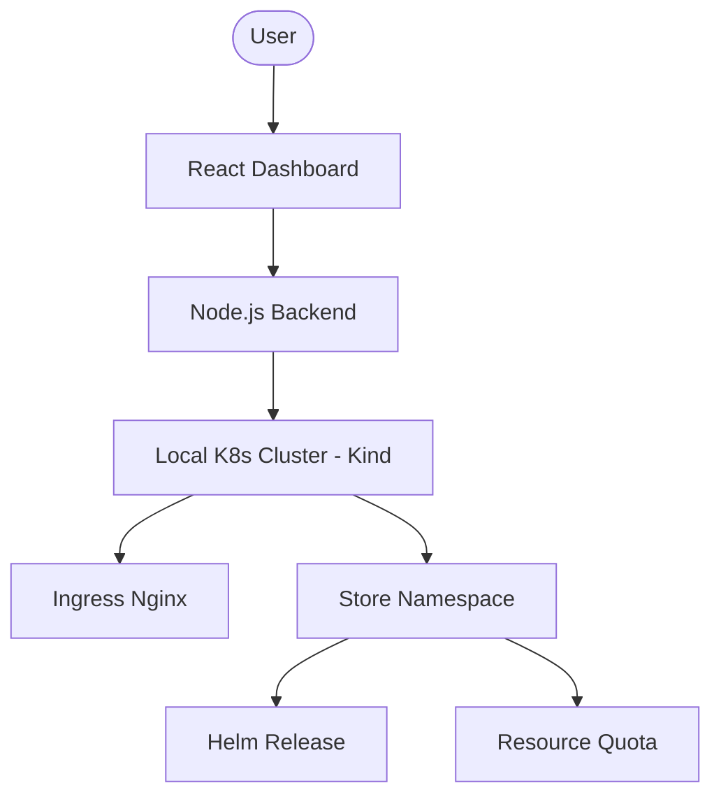

# Urumi Store Provisioning Platform

A powerful, automated store provisioning platform that orchestrates e-commerce stacks (WooCommerce and MedusaJS) on a local Kubernetes cluster using Helm.

## 🚀 Overview

This platform allows users to instantly provision fully isolated e-commerce stores. It supports two main engines:
1.  **WooCommerce**: A classic PHP/WordPress-based stack.
2.  **MedusaJS (Full Stack)**: A modern, headless commerce engine with dedicated PostgreSQL and Redis.

### Key Features
- **Automated Provisioning**: One-click store creation via Helm.
- **Resource isolation**: Dedicated `ResourceQuota` and `LimitRange` per namespace.
- **Auto-Bootstrapping**: MedusaJS stores automatically install all dependencies and seed the database on initialization.
- **Consistent Ingress**: Uses Traefik for both local and production environments.

---

## 🏗 Architecture



---

## 🛠 Prerequisites

Ensure you have the following installed:
- [Docker](https://docs.docker.com/get-docker/)
- [Kind](https://kind.sigs.k8s.io/docs/user/quick-start/)
- [Helm v3](https://helm.sh/docs/intro/install/)
- [kubectl](https://kubernetes.io/docs/tasks/tools/)
- [Node.js v20+](https://nodejs.org/)

---

## 🚦 Getting Started

📖 **For detailed step-by-step instructions, see [INSTRUCTIONS.md](./INSTRUCTIONS.md)**

### Quick Start

1. **Setup Kubernetes Cluster** (choose one method below)
2. **Start Backend**: `cd backend && npm install && node server.js`
3. **Start Dashboard**: `cd dashboard && npm install && npm run dev`
4. **Open Dashboard**: http://localhost:5173

### 1. Setup Local Cluster (k3d)

k3d is used because it closely matches production k3s environments:

```bash
./scripts/k3d-setup.sh
./scripts/k3d-install-traefik.sh
```

**Note**: The backend uses whatever Kubernetes cluster kubectl is configured for. k3d is recommended for consistency with production k3s.

### 3. Start the Backend
```bash
cd backend
npm install
node server.js
```
The backend listens at `http://localhost:3001`.

### 4. Start the Dashboard
```bash
cd dashboard
npm install
npm run dev
```
Open `http://localhost:5173` to start provisioning stores!

---

## 🌍 Environment-Specific Deployment

This platform supports both **local** and **production** deployments using environment-specific Helm values files:

- **`values-local.yaml`**: Optimized for local Kind clusters with nip.io domains
- **`values-prod.yaml`**: Production-ready configuration for k3s on VPS with TLS/SSL

### Quick Deploy

**Local (default):**
```bash
# Via API (dashboard automatically uses local)
POST /api/stores { "name": "my-store", "type": "woocommerce" }

# Via Helm
helm install my-store ./store-woocommerce -f store-woocommerce/values-local.yaml
```

**Production:**
```bash
# Via API
POST /api/stores { "name": "my-store", "type": "woocommerce", "environment": "prod" }

# Via Helm
helm install my-store ./store-woocommerce -f store-woocommerce/values-prod.yaml
```

📖 **See [ENVIRONMENT_VALUES.md](./ENVIRONMENT_VALUES.md) for detailed documentation.**

---

## 📦 Store Stacks

### WooCommerce
- **MariaDB**: Dedicated database.
- **WordPress**: Core engine.
- **Bootstrap Job**: Automated WooCommerce plugin installation and admin setup.

### MedusaJS (Full Stack)
- **PostgreSQL 15**: Dedicated storage.
- **Redis 7**: Caching and event bus.
- **Medusa Server**: Auto-bootstrapped within the container using a custom Node.js script.

---

## 🔄 Upgrading and Rolling Back Stores

### Upgrading a Store

Helm provides built-in upgrade capabilities. You can upgrade stores to new chart versions or update configuration values.

#### Upgrade Process

**1. Check current release:**
```bash
helm list -n store-<store-name>
helm get values <store-name> -n store-<store-name>
```

**2. Upgrade with new values:**
```bash
# Upgrade WooCommerce store
helm upgrade <store-name> ./store-woocommerce \
  -n store-<store-name> \
  -f store-woocommerce/values-prod.yaml \
  --set image.tag=6.9-apache \
  --set replicaCount=3

# Upgrade Medusa store
helm upgrade <store-name> ./store-medusa \
  -n store-<store-name> \
  -f store-medusa/values-prod.yaml \
  --set backend.image=adc47/medusa-backend:v2.0 \
  --set storefront.image=adc47/medusa-storefront:v2.0
```

**3. Monitor upgrade progress:**
```bash
kubectl get pods -n store-<store-name> -w
kubectl rollout status deployment/<deployment-name> -n store-<store-name>
```

#### Upgrade Considerations

- **Test first**: Always test upgrades in a local environment before production
- **Backup databases**: Backup persistent volumes before major upgrades
- **Gradual rollout**: Use Helm's `--wait` flag to ensure pods are ready before proceeding
- **Database migrations**: Some upgrades may require database migrations (handle separately if needed)
- **Secrets**: Existing secrets are preserved during upgrades

**Example with wait:**
```bash
helm upgrade <store-name> ./store-woocommerce \
  -n store-<store-name> \
  -f store-woocommerce/values-prod.yaml \
  --wait \
  --timeout 10m
```

### Rolling Back a Store

Helm maintains release history, allowing you to rollback to any previous revision.

#### Rollback Process

**1. View release history:**
```bash
helm history <store-name> -n store-<store-name>
```

**2. Rollback to previous revision:**
```bash
# Rollback to most recent previous revision
helm rollback <store-name> -n store-<store-name>

# Rollback to specific revision
helm rollback <store-name> <revision-number> -n store-<store-name>
```

**3. Verify rollback:**
```bash
helm list -n store-<store-name>
kubectl get pods -n store-<store-name>
```

#### Rollback Considerations

- **Release history**: Helm maintains up to 10 revisions by default (configurable)
- **Database state**: Database migrations may not automatically rollback - handle manually if needed
- **Persistent data**: PVCs and persistent data are preserved during rollback
- **Secrets**: Secrets are preserved - ensure they're compatible with rolled-back version

**Example:**
```bash
# View history
helm history my-store -n store-my-store

# Output:
# REVISION  UPDATED                  STATUS     CHART                    APP VERSION DESCRIPTION
# 1        Mon Jan 15 10:00:00 2024 deployed  store-woocommerce-0.1.0 6.8         Install complete
# 2        Mon Jan 15 11:00:00 2024 deployed  store-woocommerce-0.1.0 6.9         Upgrade complete
# 3        Mon Jan 15 12:00:00 2024 failed    store-woocommerce-0.1.0 6.9         Upgrade failed

# Rollback to revision 2
helm rollback my-store 2 -n store-my-store
```

### Best Practices

1. **Version Control**: Track chart versions and values files in version control
2. **Staging Environment**: Test upgrades in staging before production
3. **Backup Strategy**: Regular backups of persistent volumes
4. **Monitoring**: Monitor store health after upgrades
5. **Documentation**: Document any manual steps required for upgrades

📖 **See [SYSTEM_DESIGN.md](./SYSTEM_DESIGN.md) for detailed architecture and upgrade strategy documentation.**

---

## 🧹 Cleanup
To delete the entire setup:
```bash
kind delete cluster --name store-platform
```
