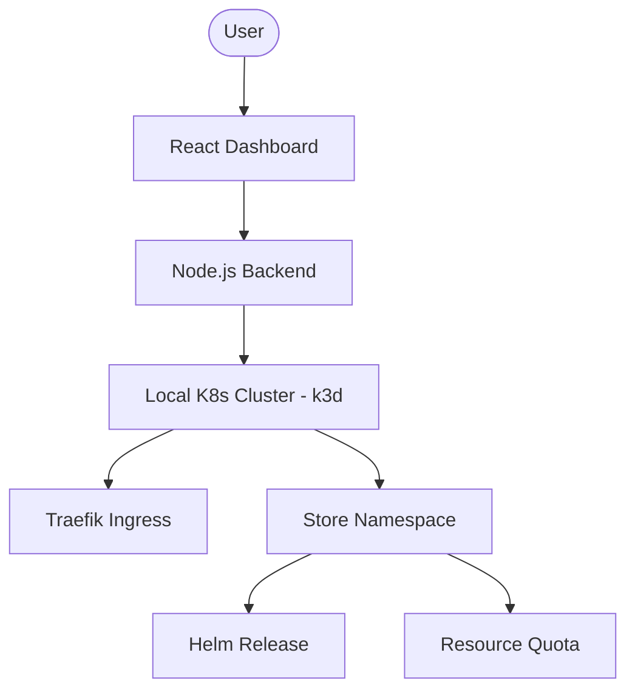

# Urumi Store Provisioning Platform

A powerful, automated store provisioning platform that orchestrates e-commerce stacks (WooCommerce and MedusaJS) on a local Kubernetes cluster using Helm.

## 🚀 Overview

This platform allows users to instantly provision fully isolated e-commerce stores. It supports two main engines:
1.  **WooCommerce**: A classic PHP/WordPress-based stack.
2.  **MedusaJS (Full Stack)**: A modern, headless commerce engine with dedicated PostgreSQL and Redis.

### Key Features
- **Automated Provisioning**: One-click store creation via Helm.
- **Resource isolation**: Dedicated `ResourceQuota` and `LimitRange` per namespace.
- **Auto-Bootstrapping**: MedusaJS stores automatically install all dependencies and seed the database on initialization.
- **Consistent Ingress**: Uses Traefik for both local and production environments.

---

## 🏗 Architecture



---

## 🛠 Prerequisites

Ensure you have the following installed:
- [Docker](https://docs.docker.com/get-docker/)
- [k3d](https://k3d.io/) (runs k3s in Docker, closely matches production k3s)
- [Helm v3](https://helm.sh/docs/intro/install/)
- [kubectl](https://kubernetes.io/docs/tasks/tools/)
- [Node.js v20+](https://nodejs.org/)

---

## 🚦 Getting Started

📖 **For detailed step-by-step instructions, see [INSTRUCTIONS.md](./INSTRUCTIONS.md)**

### Quick Start

1. **Setup Kubernetes Cluster** (choose one method below)
2. **Start Backend**: `cd backend && npm install && node server.js`
3. **Start Dashboard**: `cd dashboard && npm install && npm run dev`
4. **Open Dashboard**: http://localhost:5173

### 1. Setup Local Cluster (k3d)

k3d is used because it closely matches production k3s environments:

```bash
./scripts/k3d-setup.sh
./scripts/k3d-install-traefik.sh
```

**Note**: The backend uses whatever Kubernetes cluster kubectl is configured for. k3d is recommended for consistency with production k3s.

### 3. Start the Backend
```bash
cd backend
npm install
node server.js
```
The backend listens at `http://localhost:3001`.

### 4. Start the Dashboard
```bash
cd dashboard
npm install
npm run dev
```
Open `http://localhost:5173` to start provisioning stores!

---

## 🌍 Environment-Specific Deployment

This platform supports both **local** and **production** deployments using environment-specific Helm values files:

- **`values-local.yaml`**: Optimized for local k3d clusters with nip.io domains
- **`values-prod.yaml`**: Production-ready configuration for k3s on VPS with TLS/SSL

### Quick Deploy

**Local (default):**
```bash
# Via API (dashboard automatically uses local)
POST /api/stores { "name": "my-store", "type": "woocommerce" }

# Via Helm
helm install my-store ./store-woocommerce -f store-woocommerce/values-local.yaml
```

**Production:**
```bash
# Via API
POST /api/stores { "name": "my-store", "type": "woocommerce", "environment": "prod" }

# Via Helm
helm install my-store ./store-woocommerce -f store-woocommerce/values-prod.yaml
```

📖 **See [ENVIRONMENT_VALUES.md](./ENVIRONMENT_VALUES.md) for detailed documentation.**

---

## 🛒 Creating Stores and Placing Orders

This section provides a complete guide for creating stores and testing the end-to-end order flow.

### Creating a Store

#### Step 1: Access the Dashboard
1. **Open Dashboard**: Navigate to `http://localhost:5173` (or your production dashboard URL)
2. You'll see the main dashboard with existing stores (if any) and metrics

#### Step 2: Create New Store
1. **Click "Create New Store"** button (top right)
2. **Fill in the form**:
   - **Store Name**: e.g., `my-test-store` 
     - Must be unique, lowercase, alphanumeric (and hyphens)
     - Will create namespace: `store-<name>`
   - **Engine**: Select `WooCommerce` or `MedusaJS`
   - **Environment**: Select `Local` or `Production`
   - **Domain** (Optional): 
     - Local: Auto-generated as `<store-name>.127.0.0.1.nip.io`
     - Production: Enter your domain (e.g., `yourdomain.com`)
   - **Admin Email** (Optional): 
     - WooCommerce: Always uses `admin` username
     - Medusa: Auto-generated as `admin@<domain>` if not provided
3. **Click "Provision Store"**

#### Step 3: Monitor Provisioning
- Store appears immediately with `Provisioning` status
- Status updates automatically every 5 seconds
- Typical provisioning time: **2-5 minutes**
- Watch the activity log for progress updates
- Status changes to `Ready` when complete

#### Step 4: Get Admin Credentials
1. **Click "View Details"** on the store card
2. **Expand the store details** to see:
   - **Admin Credentials**: Username/password with copy button
   - **Store URLs**: Clickable links to storefront and admin
   - **Activity Log**: Color-coded events showing provisioning progress

### Placing an Order (End-to-End Test)

This verifies that your store is fully functional and can process orders.

#### WooCommerce - Complete Order Flow

**1. Access Storefront**
- Click the store URL in dashboard (e.g., `http://my-store.127.0.0.1.nip.io`)
- Or manually navigate to the URL shown in store details

**2. Browse Products**
- Default WooCommerce installation includes sample products
- Browse the storefront
- Click on any product to view details

**3. Add Product to Cart**
- Click "Add to cart" button on any product
- Cart icon updates with item count
- View cart to see added items

**4. Proceed to Checkout**
- Click cart icon → "Proceed to checkout"
- Fill in checkout form:
  - Billing details (name, email, address)
  - Shipping details (if different)
- Review order summary

**5. Select Payment Method**
- Choose "Cash on Delivery" (test-friendly method)
- Or use any other available payment gateway

**6. Place Order**
- Click "Place order" button
- Order confirmation page appears
- Note the order number

**7. Verify Order in Admin**
- Get admin credentials from dashboard (click "View Details")
- Navigate to admin: `<store-url>/wp-admin`
- Login with:
  - Username: `admin`
  - Password: (from dashboard, use copy button)
- Go to **WooCommerce → Orders**
- Find your order and verify:
  - Order status
  - Customer details
  - Products ordered
  - Payment method

**✅ Success Criteria**: Order appears in WooCommerce admin with correct details

#### Medusa - Complete Order Flow

**1. Access Storefront**
- Click the storefront URL in dashboard
- Medusa provides a modern storefront interface

**2. Browse Products**
- Default Medusa starter includes sample products
- Browse categories and products
- View product details

**3. Add Product to Cart**
- Click "Add to cart" on any product
- Cart updates automatically
- View cart to see items

**4. Proceed to Checkout**
- Click checkout button
- Fill in shipping information
- Select shipping method
- Enter payment details (test mode)

**5. Complete Order**
- Review order summary
- Click "Place order"
- Order confirmation appears

**6. Verify Order in Admin**
- Get admin credentials from dashboard
- Navigate to admin: `<backend-url>/app`
- Login with:
  - Email: `admin@<domain>` (shown in dashboard)
  - Password: (from dashboard, use copy button)
- Navigate to **Orders**
- Find your order and verify details

**✅ Success Criteria**: Order appears in Medusa admin with correct details

### Troubleshooting Order Placement

**Store URL not accessible:**
- Check ingress: `kubectl get ingress -n store-<name>`
- Verify Traefik is running: `kubectl get pods -n kube-system | grep traefik`
- Check DNS resolution (for nip.io domains)

**Admin credentials don't work:**
- Ensure store status is `Ready` (not `Provisioning`)
- Check bootstrap job completed: `kubectl get jobs -n store-<name>`
- Verify credentials in dashboard (use copy button)

**Products not showing:**
- WooCommerce: Check if bootstrap job installed WooCommerce plugin
- Medusa: Verify migrate job completed successfully

📖 **For detailed troubleshooting, see [INSTRUCTIONS.md](./INSTRUCTIONS.md#troubleshooting)**

---

## 🚀 Production Deployment (VPS/k3s)

This platform is designed to deploy to production VPS servers running k3s using the **same Helm charts** as local development. Only configuration changes are needed via Helm values files.

### Prerequisites for Production

**VPS Requirements:**
- **OS**: Ubuntu 20.04+ or Debian 11+ (recommended)
- **Resources**: 
  - Minimum: 2GB RAM, 2 CPU cores, 20GB disk
  - Recommended: 4GB+ RAM, 4+ CPU cores, 50GB+ disk
- **Network**: Public IP address, ports 80/443 open
- **Access**: SSH access with sudo privileges

**Additional Requirements:**
- Domain name with DNS management access
- Email address for Let's Encrypt certificates
- Basic knowledge of Kubernetes and Helm

### Step-by-Step Production Setup

#### Step 1: Prepare VPS

**1.1. Update System**
```bash
# SSH into your VPS
ssh user@your-vps-ip

# Update system packages
sudo apt update && sudo apt upgrade -y

# Install basic tools
sudo apt install -y curl wget git vim
```

**1.2. Configure Firewall**
```bash
# Allow SSH, HTTP, HTTPS
sudo ufw allow 22/tcp
sudo ufw allow 80/tcp
sudo ufw allow 443/tcp
sudo ufw enable
```

#### Step 2: Install k3s on VPS

**2.1. Install k3s**
```bash
# Install k3s (lightweight Kubernetes)
curl -sfL https://get.k3s.io | sh -

# Verify installation
sudo k3s kubectl get nodes
```

**Expected Output:**
```
NAME           STATUS   ROLES                  AGE   VERSION
your-vps-name  Ready    control-plane,master   30s   v1.28.x+k3s1
```

**2.2. Configure kubectl Access**
```bash
# Create kubectl config directory
mkdir -p ~/.kube

# Copy k3s config
sudo cp /etc/rancher/k3s/k3s.yaml ~/.kube/config

# Fix permissions
sudo chown $USER:$USER ~/.kube/config
chmod 600 ~/.kube/config

# Test kubectl (should work without sudo)
kubectl get nodes
```

**2.3. Install Helm (if not included)**
```bash
# k3s includes Helm, but verify
helm version

# If not installed:
curl https://raw.githubusercontent.com/helm/helm/main/scripts/get-helm-3 | bash
```

#### Step 3: Configure Remote kubectl Access (Optional)

If you want to manage the cluster from your local machine:

**3.1. Copy kubeconfig from VPS**
```bash
# On your local machine
mkdir -p ~/.kube
scp user@your-vps-ip:~/.kube/config ~/.kube/config-vps

# Update server address (replace 127.0.0.1 with VPS IP)
sed -i 's/127.0.0.1/your-vps-ip/g' ~/.kube/config-vps

# Use this config: export KUBECONFIG=~/.kube/config-vps
# Or merge with existing config
```

**3.2. Verify Remote Connection**
```bash
# On local machine
export KUBECONFIG=~/.kube/config-vps
kubectl get nodes
```

#### Step 4: Install and Configure Traefik

**4.1. Verify Traefik Installation**
k3s comes with Traefik by default:

```bash
# Check if Traefik is running
kubectl get pods -n kube-system | grep traefik

# Check Traefik service
kubectl get svc -n kube-system | grep traefik
```

**4.2. Configure Traefik for Production**

If Traefik is not installed or needs reconfiguration:

```bash
# Add Traefik Helm repo
helm repo add traefik https://traefik.github.io/charts
helm repo update

# Install Traefik
helm install traefik traefik/traefik \
  -n kube-system \
  --set ports.web.redirectTo=websecure \
  --set ports.websecure.tls.enabled=true

# Wait for Traefik to be ready
kubectl wait --for=condition=ready pod -l app.kubernetes.io/name=traefik -n kube-system --timeout=90s
```

**4.3. Verify Traefik Ingress Class**
```bash
# Check ingress class
kubectl get ingressclass

# Should show 'traefik' as default
```

#### Step 5: Install cert-manager (for TLS/HTTPS)

**5.1. Install cert-manager**
```bash
# Install cert-manager CRDs and controller
kubectl apply -f https://github.com/cert-manager/cert-manager/releases/download/v1.13.0/cert-manager.yaml

# Wait for cert-manager to be ready (may take 1-2 minutes)
kubectl wait --for=condition=ready pod \
  -l app.kubernetes.io/instance=cert-manager \
  -n cert-manager \
  --timeout=120s

# Verify installation
kubectl get pods -n cert-manager
```

**5.2. Create Let's Encrypt ClusterIssuer**
```bash
# Create ClusterIssuer for Let's Encrypt
cat <<EOF | kubectl apply -f -
apiVersion: cert-manager.io/v1
kind: ClusterIssuer
metadata:
  name: letsencrypt-prod
spec:
  acme:
    server: https://acme-v02.api.letsencrypt.org/directory
    email: your-email@example.com  # Replace with your email
    privateKeySecretRef:
      name: letsencrypt-prod
    solvers:
    - http01:
        ingress:
          class: traefik
EOF

# Verify ClusterIssuer
kubectl get clusterissuer
```

**Replace `your-email@example.com` with your actual email address.**

#### Step 6: Configure DNS

**6.1. Point Domain to VPS**
Configure DNS records at your domain registrar:

```
Type: A
Name: *
Value: your-vps-ip
TTL: 3600

Type: A
Name: @
Value: your-vps-ip
TTL: 3600
```

**6.2. Verify DNS Propagation**
```bash
# Check DNS resolution (from local machine)
dig yourdomain.com
dig *.yourdomain.com

# Should resolve to your VPS IP
```

**Wait 5-15 minutes for DNS propagation before proceeding.**

#### Step 7: Deploy Backend and Dashboard

**Option A: Run on VPS Directly (Simpler)**

**7.1. Clone Repository**
```bash
# On VPS
cd ~
git clone <your-repo-url>
cd urumi-store-platform
```

**7.2. Install Node.js (if not installed)**
```bash
# Install Node.js 20+
curl -fsSL https://deb.nodesource.com/setup_20.x | sudo -E bash -
sudo apt-get install -y nodejs

# Verify
node --version  # Should be v20.x or higher
npm --version
```

**7.3. Install Dependencies**
```bash
# Install backend dependencies
cd backend
npm install

# Install dashboard dependencies
cd ../dashboard
npm install
```

**7.4. Configure Backend Environment**
```bash
# Create backend .env file
cd ~/urumi-store-platform/backend
cat > .env << EOF
DEFAULT_ENVIRONMENT=prod
PRODUCTION_DOMAIN=yourdomain.com
PORT=3001
EOF
```

**7.5. Start Backend (Production Mode)**

**Using PM2 (Recommended):**
```bash
# Install PM2
sudo npm install -g pm2

# Start backend
cd ~/urumi-store-platform/backend
pm2 start server.js --name store-backend

# Start dashboard (build first)
cd ~/urumi-store-platform/dashboard
npm run build
pm2 serve dist 5173 --name store-dashboard --spa

# Save PM2 configuration
pm2 save
pm2 startup  # Follow instructions to enable auto-start
```

**Using systemd:**
```bash
# Create systemd service files (see INSTRUCTIONS.md for details)
```

**7.6. Verify Services**
```bash
# Check backend
curl http://localhost:3001/api/stores

# Check dashboard
curl http://localhost:5173

# Check PM2 status
pm2 status
pm2 logs store-backend
```

**Option B: Deploy as Kubernetes Pods (Advanced)**

Create Helm charts for backend and dashboard, then deploy:
```bash
# Example (requires creating Helm charts)
helm install backend ./backend-chart -f backend-chart/values-prod.yaml
helm install dashboard ./dashboard-chart -f dashboard-chart/values-prod.yaml
```

#### Step 8: Apply RBAC Permissions

**8.1. Apply RBAC for Backend**
```bash
cd ~/urumi-store-platform

# Apply ClusterRole
kubectl apply -f backend/rbac/clusterrole.yaml

# Create ClusterRoleBinding for your user
# Replace <USERNAME> with your VPS username
kubectl create clusterrolebinding store-provisioner-user-binding \
  --clusterrole=store-provisioner \
  --user=$(whoami)

# Verify permissions
kubectl auth can-i create namespaces --as=$(whoami)
kubectl auth can-i create secrets --as=$(whoami)
```

**Or use the script:**
```bash
./scripts/apply-rbac.sh
# Select option 1 (Process-based)
# Enter your username when prompted
```

#### Step 9: Create Production Store

**9.1. Via Dashboard**
1. Open dashboard: `http://your-vps-ip:5173` (or configure reverse proxy)
2. Click "Create New Store"
3. Fill form:
   - Store Name: `my-prod-store`
   - Engine: `WooCommerce` or `MedusaJS`
   - Environment: **Select "Production"**
   - Domain: `yourdomain.com`
   - Admin Email: (optional)
4. Click "Provision Store"
5. Wait for provisioning (2-5 minutes)
6. Store will be available at: `https://my-prod-store.yourdomain.com`

**9.2. Via API**
```bash
# Create production store via API
curl -X POST http://localhost:3001/api/stores \
  -H "Content-Type: application/json" \
  -d '{
    "name": "my-prod-store",
    "type": "woocommerce",
    "environment": "prod",
    "domain": "yourdomain.com"
  }'

# Response includes store details and URLs
```

**9.3. Verify Store Deployment**
```bash
# Check namespace
kubectl get namespace store-my-prod-store

# Check pods
kubectl get pods -n store-my-prod-store

# Check ingress
kubectl get ingress -n store-my-prod-store

# Check TLS certificate
kubectl get certificate -n store-my-prod-store
```

### Production Verification Checklist

- [ ] k3s cluster is running (`kubectl get nodes`)
- [ ] Traefik is running (`kubectl get pods -n kube-system | grep traefik`)
- [ ] cert-manager is running (`kubectl get pods -n cert-manager`)
- [ ] ClusterIssuer created (`kubectl get clusterissuer`)
- [ ] DNS records point to VPS IP
- [ ] Backend is running (`curl http://localhost:3001/api/stores`)
- [ ] Dashboard is accessible
- [ ] RBAC permissions applied (`kubectl auth can-i create namespaces`)
- [ ] Production store created successfully
- [ ] Store accessible via HTTPS (`https://store-name.yourdomain.com`)
- [ ] TLS certificate issued (`kubectl get certificate`)

### Production Considerations

**Security:**
- **Secrets**: Production stores use auto-generated secure secrets (displayed in dashboard)
- **TLS**: Automatic TLS certificates via cert-manager + Let's Encrypt
- **RBAC**: Least-privilege permissions applied
- **Network Policies**: Enabled in production values files
- **Container Security**: Containers run as non-root where possible

**Storage:**
- Uses `local-path` storage class (k3s default)
- Persistent volumes for databases
- Consider backup strategy for production data

**Scaling:**
- HPA (Horizontal Pod Autoscaler) enabled for production stores
- Multiple replicas for high availability
- Resource quotas per store namespace

**Monitoring:**
- Set up monitoring and alerting (Prometheus/Grafana recommended)
- Monitor cluster resources (`kubectl top nodes`)
- Monitor store health and provisioning metrics

**Backup:**
- Regular backups of persistent volumes
- Backup `backend/stores.json` (store metadata)
- Document recovery procedures

**Maintenance:**
- Regular k3s updates
- Helm chart version management
- Store upgrade/rollback procedures documented

### Troubleshooting Production Deployment

**Store not accessible via HTTPS:**
```bash
# Check certificate status
kubectl describe certificate -n store-<name>

# Check cert-manager logs
kubectl logs -n cert-manager -l app=cert-manager

# Verify DNS resolution
dig store-name.yourdomain.com
```

**Backend can't create namespaces:**
```bash
# Verify RBAC
kubectl auth can-i create namespaces --as=$(whoami)

# Re-apply RBAC if needed
./scripts/apply-rbac.sh
```

**TLS certificate not issued:**
- Check DNS propagation (may take time)
- Verify ClusterIssuer configuration
- Check cert-manager logs for errors
- Ensure domain points to VPS IP

📖 **For detailed production configuration, see:**
- [ENVIRONMENT_VALUES.md](./docs/ENVIRONMENT_VALUES.md) - Production values differences
- [TLS_SETUP.md](./docs/TLS_SETUP.md) - TLS/HTTPS configuration details
- [SYSTEM_DESIGN.md](./SYSTEM_DESIGN.md) - Production architecture and tradeoffs
- [INSTRUCTIONS.md](./INSTRUCTIONS.md#troubleshooting) - Troubleshooting guide

---

## 📦 Store Stacks

### WooCommerce
- **MariaDB**: Dedicated database.
- **WordPress**: Core engine.
- **Bootstrap Job**: Automated WooCommerce plugin installation and admin setup.

### MedusaJS (Full Stack)
- **PostgreSQL 15**: Dedicated storage.
- **Redis 7**: Caching and event bus.
- **Medusa Server**: Auto-bootstrapped within the container using a custom Node.js script.

---

## 🔄 Upgrading and Rolling Back Stores

### Upgrading a Store

Helm provides built-in upgrade capabilities. You can upgrade stores to new chart versions or update configuration values.

#### Upgrade Process

**1. Check current release:**
```bash
helm list -n store-<store-name>
helm get values <store-name> -n store-<store-name>
```

**2. Upgrade with new values:**
```bash
# Upgrade WooCommerce store
helm upgrade <store-name> ./store-woocommerce \
  -n store-<store-name> \
  -f store-woocommerce/values-prod.yaml \
  --set image.tag=6.9-apache \
  --set replicaCount=3

# Upgrade Medusa store
helm upgrade <store-name> ./store-medusa \
  -n store-<store-name> \
  -f store-medusa/values-prod.yaml \
  --set backend.image=adc47/medusa-backend:v2.0 \
  --set storefront.image=adc47/medusa-storefront:v2.0
```

**3. Monitor upgrade progress:**
```bash
kubectl get pods -n store-<store-name> -w
kubectl rollout status deployment/<deployment-name> -n store-<store-name>
```

#### Upgrade Considerations

- **Test first**: Always test upgrades in a local environment before production
- **Backup databases**: Backup persistent volumes before major upgrades
- **Gradual rollout**: Use Helm's `--wait` flag to ensure pods are ready before proceeding
- **Database migrations**: Some upgrades may require database migrations (handle separately if needed)
- **Secrets**: Existing secrets are preserved during upgrades

**Example with wait:**
```bash
helm upgrade <store-name> ./store-woocommerce \
  -n store-<store-name> \
  -f store-woocommerce/values-prod.yaml \
  --wait \
  --timeout 10m
```

### Rolling Back a Store

Helm maintains release history, allowing you to rollback to any previous revision.

#### Rollback Process

**1. View release history:**
```bash
helm history <store-name> -n store-<store-name>
```

**2. Rollback to previous revision:**
```bash
# Rollback to most recent previous revision
helm rollback <store-name> -n store-<store-name>

# Rollback to specific revision
helm rollback <store-name> <revision-number> -n store-<store-name>
```

**3. Verify rollback:**
```bash
helm list -n store-<store-name>
kubectl get pods -n store-<store-name>
```

#### Rollback Considerations

- **Release history**: Helm maintains up to 10 revisions by default (configurable)
- **Database state**: Database migrations may not automatically rollback - handle manually if needed
- **Persistent data**: PVCs and persistent data are preserved during rollback
- **Secrets**: Secrets are preserved - ensure they're compatible with rolled-back version

**Example:**
```bash
# View history
helm history my-store -n store-my-store

# Output:
# REVISION  UPDATED                  STATUS     CHART                    APP VERSION DESCRIPTION
# 1        Mon Jan 15 10:00:00 2024 deployed  store-woocommerce-0.1.0 6.8         Install complete
# 2        Mon Jan 15 11:00:00 2024 deployed  store-woocommerce-0.1.0 6.9         Upgrade complete
# 3        Mon Jan 15 12:00:00 2024 failed    store-woocommerce-0.1.0 6.9         Upgrade failed

# Rollback to revision 2
helm rollback my-store 2 -n store-my-store
```

### Best Practices

1. **Version Control**: Track chart versions and values files in version control
2. **Staging Environment**: Test upgrades in staging before production
3. **Backup Strategy**: Regular backups of persistent volumes
4. **Monitoring**: Monitor store health after upgrades
5. **Documentation**: Document any manual steps required for upgrades

📖 **For comprehensive upgrade and rollback guide, see [docs/UPGRADE_ROLLBACK.md](./docs/UPGRADE_ROLLBACK.md)**  
📖 **See [SYSTEM_DESIGN.md](./SYSTEM_DESIGN.md) for detailed architecture and upgrade strategy documentation.**

---

## 🧹 Cleanup

### Local Cluster Cleanup
To delete the entire k3d cluster:
```bash
k3d cluster delete urumi-prod-test
```

Or use the cleanup script:
```bash
./scripts/k3d-cleanup.sh
```

### Production Cleanup
For production deployments, delete stores via dashboard or:
```bash
# Delete all store namespaces
kubectl get namespaces -o name | grep store- | xargs kubectl delete

# Delete backend state (if needed)
rm backend/stores.json
```

📖 **For detailed cleanup instructions, see [INSTRUCTIONS.md](./INSTRUCTIONS.md#cleanup)**
