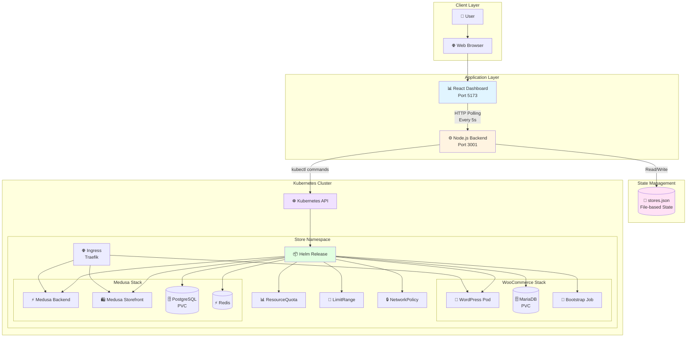
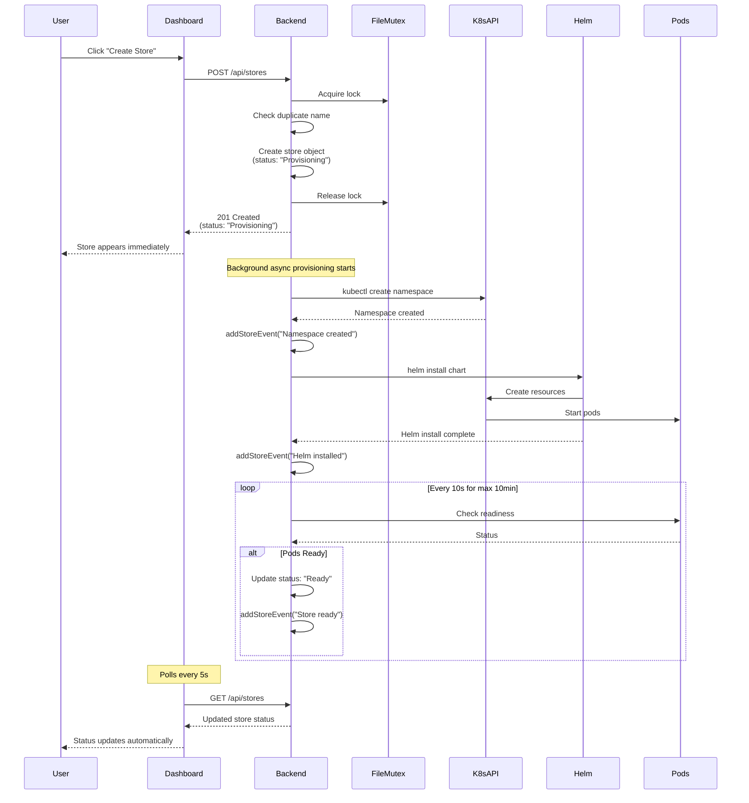
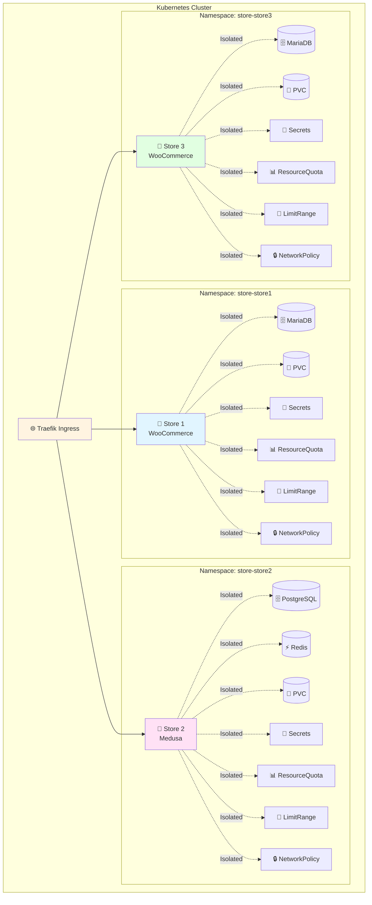
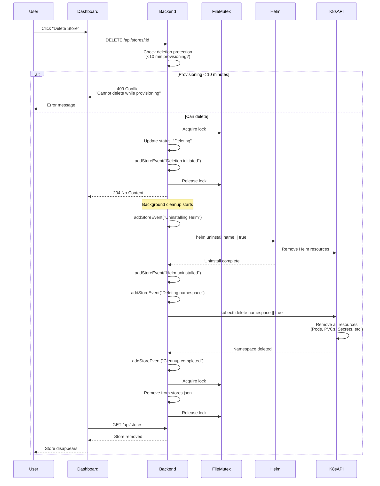
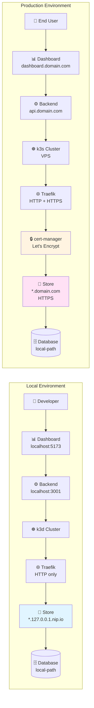
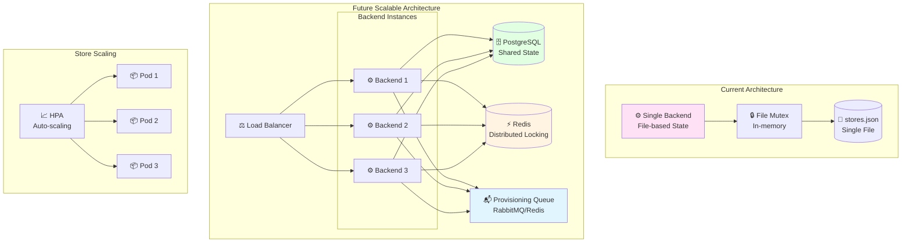
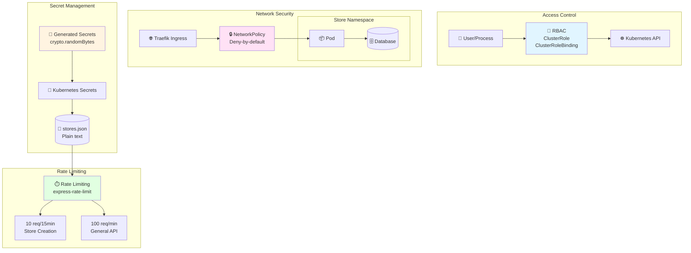
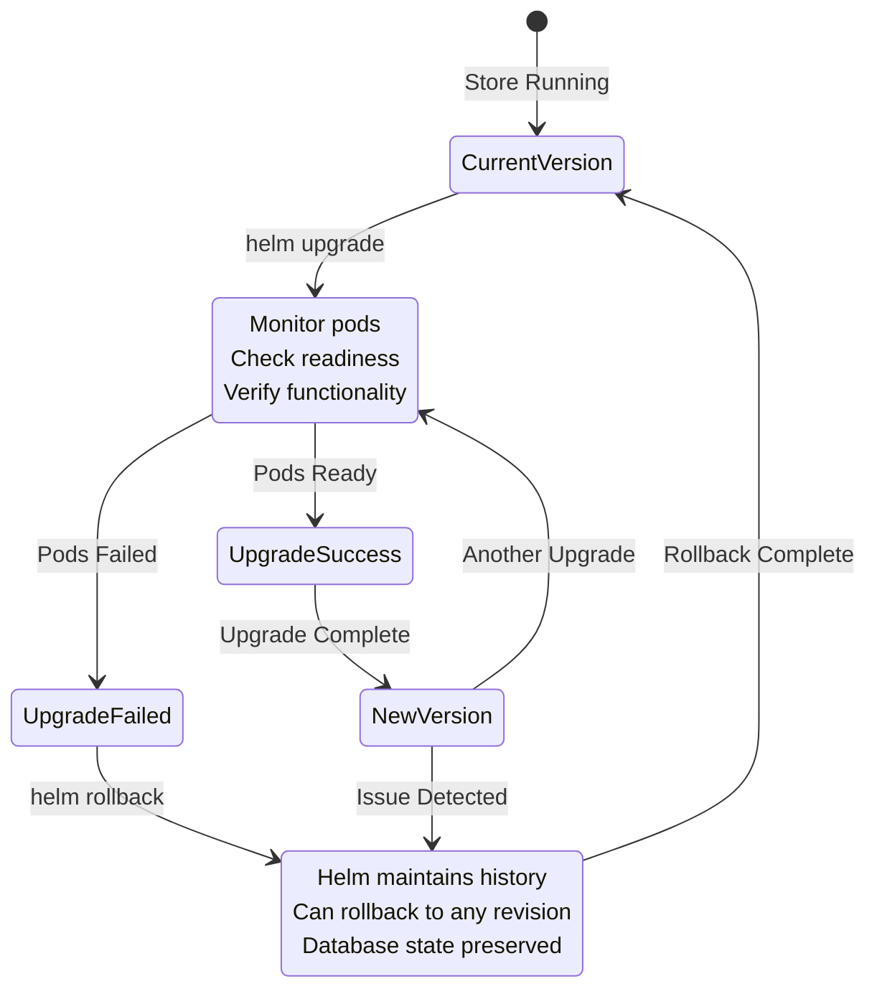

# System Design & Tradeoffs

This document outlines the architecture choices, design decisions, and tradeoffs made in building the Urumi Store Platform.

> **📊 Diagram Viewing**: This document contains **Mermaid diagrams** that render as visual diagrams.
> 
> **To view diagrams properly:**
> - ✅ **GitHub/GitLab**: Diagrams render automatically when viewing on GitHub
> - ✅ **VS Code**: Install "Markdown Preview Mermaid Support" extension, then use "Open Preview"
> - ✅ **Online**: Copy diagram code to [Mermaid Live Editor](https://mermaid.live) to view instantly
> - ⚠️ **Plain text editors**: Will show code blocks (diagrams need a Mermaid-compatible viewer)
> 
> **Quick test**: If you see code blocks starting with ````mermaid` instead of visual diagrams, your viewer doesn't support Mermaid. View the file on GitHub or use the Mermaid Live Editor.

---

## Architecture Overview

The platform is a **multi-tenant store provisioning system** that orchestrates Kubernetes resources to deploy ecommerce stores (WooCommerce or MedusaJS) on demand. The architecture follows a **stateless backend + Helm-based provisioning** pattern.

### Core Components

1. **Dashboard** (React + Vite)
   - Frontend UI for managing stores
   - Real-time status updates via polling (every 5 seconds)
   - Displays metrics in header (total stores, by status, provisioning duration)
   - Shows admin credentials in expanded store view
   - Displays color-coded activity logs per store

2. **Backend API** (Node.js + Express)
   - RESTful API for store CRUD operations
   - Orchestrates Helm chart deployments
   - Manages store state and metadata

3. **Helm Charts**
   - `store-woocommerce`: WordPress + MariaDB + Bootstrap job
   - `store-medusa`: Backend + Storefront + PostgreSQL + Bootstrap

4. **Kubernetes Cluster**
   - Local: Kind/k3d/Minikube
   - Production: k3s on VPS

### System Architecture Diagram



---

## Architecture Choices

### 1. File-Based State Management

**Choice**: Store metadata in JSON file (`stores.json`) instead of a database.

**Rationale**:
- Simplicity: No database setup required
- Portability: Easy to backup and migrate
- Sufficient for MVP: Handles concurrent operations via file locking

**Tradeoffs**:
- ✅ Simple deployment (no database dependency)
- ✅ Easy to inspect and debug
- ✅ Atomic operations via file mutex
- ❌ Not suitable for high-scale production (1000+ stores)
- ❌ No query capabilities beyond in-memory filtering

**Future Migration Path**: Can migrate to PostgreSQL/MySQL when needed without changing API contracts.

### 2. File Mutex for Concurrency Control

**Choice**: Custom `FileMutex` class for serializing file operations.

**Rationale**:
- Prevents race conditions in concurrent store creation/deletion
- Ensures atomic read-modify-write operations
- Simple implementation without external dependencies

**Implementation**:
```javascript
class FileMutex {
    // Queue-based locking mechanism
    // Ensures only one operation modifies stores.json at a time
}
```

**Tradeoffs**:
- ✅ Prevents data corruption
- ✅ Simple and reliable
- ❌ Sequential operations (not a bottleneck for current scale)
- ❌ In-memory only (doesn't survive backend restarts)

### 3. Background Provisioning

**Choice**: Store creation returns immediately, provisioning happens asynchronously.

**Rationale**:
- Better UX: Users don't wait for long provisioning operations
- Prevents HTTP timeouts
- Allows concurrent provisioning of multiple stores

**Implementation**:
- API returns 201 immediately with `status: "Provisioning"`
- Background async function handles Helm deployment
- Status updates via periodic refresh mechanism

**Store Provisioning Flow**:



**Tradeoffs**:
- ✅ Fast API response
- ✅ Better user experience
- ✅ Handles concurrent provisioning
- ❌ Requires status polling mechanism
- ❌ More complex error handling

### 4. Namespace-Per-Store Isolation

**Choice**: Each store gets its own Kubernetes namespace (`store-<name>`).

**Rationale**:
- Complete resource isolation
- Easy cleanup (delete namespace = delete all resources)
- Natural multi-tenancy boundary
- Kubernetes-native approach

**Multi-Tenant Isolation Architecture**:



**Tradeoffs**:
- ✅ Strong isolation
- ✅ Simple cleanup
- ✅ Resource quotas per namespace
- ✅ Network policies per namespace
- ❌ Namespace overhead (minimal)
- ❌ Namespace limits (not an issue for current scale)

### 5. Helm Charts for Store Deployment

**Choice**: Use Helm charts instead of raw Kubernetes manifests or operators.

**Rationale**:
- Standard Kubernetes package manager
- Template-based configuration
- Easy upgrades and rollbacks
- Values files for environment differences

**Tradeoffs**:
- ✅ Industry standard
- ✅ Template reusability
- ✅ Version management
- ✅ Rollback support
- ❌ Learning curve for Helm templating
- ❌ Chart maintenance overhead

### 6. Environment-Specific Values Files

**Choice**: Separate `values-local.yaml` and `values-prod.yaml` files.

**Rationale**:
- Same charts work in local and production
- Clear separation of concerns
- Easy to understand differences
- Backend selects appropriate values file

**Tradeoffs**:
- ✅ Single source of truth for charts
- ✅ Environment-specific configuration
- ✅ Easy to compare differences
- ❌ Must maintain two values files
- ❌ Risk of drift between environments

---

## Idempotency & Failure Handling

### Idempotent Operations

**Store Creation**:
- Atomic check-and-create prevents duplicates
- File mutex ensures thread-safe operations
- Duplicate name detection before provisioning starts
- Status tracking prevents duplicate provisioning

**Store Deletion**:
- Idempotent Helm uninstall (`|| true` ensures no error if already deleted)
- Idempotent namespace deletion (`|| true`)
- Safe to retry deletion operations

**Status Updates**:
- Atomic read-modify-write operations
- File mutex prevents concurrent modifications
- Status transitions are validated

### Failure Handling

**Provisioning Failures**:
1. **Timeout Detection**: 
   - 20-minute timeout for Helm install (accommodates cold starts and image pulling)
   - 10-minute timeout for readiness checks (after Helm install)
   - Overall provisioning can take up to 30 minutes in worst-case scenarios
2. **Error Capture**: Errors stored in store object with `error` field
3. **Status Tracking**: Failed stores marked with `status: "Failed"`
4. **Event Logging**: All failures logged with timestamps
5. **Recovery**: Periodic status refresh can detect recovery

**Recovery Mechanisms**:
- **Status Refresh**: Periodic checks (every 5 seconds) verify actual Kubernetes state
  - Checks namespace existence and pod readiness
  - Updates status based on actual Kubernetes state
  - Preserves secrets during status updates (prevents data loss)
  - Can detect recovery from Failed to Ready state
- **Grace Period**: 30-second grace period before marking as Failed
- **Stuck Detection**: 
  - Stores provisioning >=10 minutes can be deleted (likely stuck)
  - Stores provisioning >=30 minutes are definitely stuck and can be deleted
- **Readiness Verification**: Comprehensive checks (pods, jobs, ingress)

**Failure Scenarios Handled**:
- Namespace creation failure
- Helm installation failure
- Pod startup failures
- Database connection failures
- Timeout scenarios
- Backend restart during provisioning

### Cleanup Guarantees

**Deletion Process**:
1. Mark store as `Deleting` (prevents concurrent operations)
2. Uninstall Helm release (idempotent)
3. Delete namespace (idempotent, removes all resources)
4. Remove from stores.json

**Store Deletion Flow**:



**Protection Mechanisms**:
- Cannot delete stores actively provisioning (<10 minutes, Helm release exists)
- Can delete stuck stores (>=10 minutes provisioning - likely stuck)
- Can delete stores definitely stuck (>=30 minutes provisioning)
- Can delete stores with failed Helm releases
- Status reversion on deletion errors

**Resource Cleanup**:
- Helm uninstall removes all Helm-managed resources
- Namespace deletion removes remaining resources (PVCs, Secrets, etc.)
- Idempotent operations ensure safe retries

---

## Production Differences

### Local vs Production Architecture



### DNS & Ingress

**Local**:
- Domain: `<store-name>.127.0.0.1.nip.io`
- Protocol: HTTP
- Ingress: Traefik with `web` entrypoint only
- No TLS certificates

**Production**:
- Domain: `<store-name>.<your-domain>`
- Protocol: HTTPS
- Ingress: Traefik with `web,websecure` entrypoints
- TLS: cert-manager + Let's Encrypt
- WordPress HTTPS detection via `X-Forwarded-Proto` header

**Configuration**:
- Backend detects domain type (nip.io vs real domain)
- Automatically enables TLS for production domains
- Sets appropriate ingress annotations

### Storage Classes

**Local**:
- Kind: `standard` storage class
- k3d/k3s: `local-path` storage class
- Auto-detected by backend

**Production**:
- k3s: `local-path` storage class (default)
- Explicitly configured in `values-prod.yaml`

**Adaptation**:
- Backend detects storage class availability
- Adapts values files if needed
- Ensures compatibility across environments

### Secrets Management

**Local**:
- Default passwords in `values-local.yaml` (acceptable for dev)
- Secrets created via Helm templates
- No external secret management

**Production**:
- **Automatic Secret Generation**: Backend automatically generates secure random secrets for production stores
  - Uses `crypto.randomBytes()` for cryptographically secure random generation
  - No hardcoded passwords - all production secrets are generated on-the-fly
  - Secrets generated include: database passwords, admin passwords, JWT secrets, cookie secrets
  - Generated secrets passed to Helm via `--set` flags during provisioning
- No default passwords in `values-prod.yaml` (empty values require explicit secrets)
- Secrets stored in `stores.json` for retrieval and dashboard display
- Should use external secret management (Sealed Secrets, External Secrets Operator) for production
- Medusa requires explicit JWT_SECRET, COOKIE_SECRET (both auto-generated for production stores)

**Secrets Storage & Display**:
- Production secrets stored in `backend/stores.json` per store
- Dashboard displays admin credentials in expanded store view
- Copy-to-clipboard functionality for easy access
- Secrets preserved during status refresh operations
- WooCommerce: Username (`admin`) and password displayed
- Medusa: Email (auto-generated from domain) and password displayed

**Security Considerations**:
- **No Hardcoded Secrets**: Production secrets are never hardcoded - always generated securely
- Never commit production secrets to version control
- Use environment variables or secret files for manual provisioning
- Consider Vault or similar for production secret management
- Secrets in `stores.json` are plain text (acceptable for MVP, should encrypt for production)
- Secret generation uses Node.js `crypto.randomBytes()` for cryptographically secure randomness

### Resource Allocation

**Local**:
- Lower CPU/memory limits (development)
- Single replica
- No autoscaling
- Minimal storage (1-2Gi)

**Production**:
- Higher CPU/memory limits (production workloads)
- Multiple replicas (high availability)
- HPA autoscaling enabled
- Larger storage (10-20Gi)

### Replicas & Autoscaling

**Local**:
- `replicaCount: 1`
- `autoscaling.enabled: false`

**Production**:
- `replicaCount: 2` (WooCommerce), `1` (Medusa - resource constrained)
- `autoscaling.enabled: true`
- HPA configured with CPU/memory targets
- **WooCommerce**: Single HPA for WordPress deployment
- **Medusa**: Separate HPAs for backend and storefront deployments (allows independent scaling)

### Network Policies

**Local**:
- `networkPolicy.enabled: false` (optional, can enable for testing)

**Production**:
- `networkPolicy.enabled: true`
- Deny-by-default with required allows
- Ingress from Traefik only
- Egress for DNS and internet

### WordPress HTTPS Configuration

**Local**:
- `FORCE_SSL_ADMIN: false`
- No HTTPS detection needed

**Production**:
- `FORCE_SSL_ADMIN: true` (when TLS enabled)
- Detects HTTPS from `X-Forwarded-Proto` header
- Properly handles Traefik proxy termination

**Implementation**:
```php
// WordPress wp-config.php detects HTTPS behind proxy
if (isset($_SERVER['HTTP_X_FORWARDED_PROTO']) && $_SERVER['HTTP_X_FORWARDED_PROTO'] === 'https') {
    $_SERVER['HTTPS'] = 'on';
}
```

---

## Observability & Monitoring

### Observability Architecture

```mermaid
graph TB
    subgraph "Data Collection"
        Backend[⚙️ Backend API]
        K8sAPI[☸️ Kubernetes API]
        StoresJSON[(📄 stores.json)]
    end
    
    subgraph "Metrics & Events"
        MetricsEP[/api/metrics<br/>Endpoint]
        Events[📝 Event Logs<br/>per Store]
        StatusRefresh[🔄 Status Refresh<br/>Every 5s]
    end
    
    subgraph "Dashboard Display"
        MetricsHeader[📊 Metrics Header<br/>Total, Status, Duration]
        StoreCards[🏪 Store Cards<br/>Status, URL, Timestamp]
        StoreDetails[📋 Store Details<br/>Credentials, Events]
        ActivityLog[📜 Activity Log<br/>Color-coded Events]
    end
    
    Backend --> MetricsEP
    Backend --> Events
    Backend --> StatusRefresh
    K8sAPI --> StatusRefresh
    StoresJSON --> MetricsEP
    StoresJSON --> Events
    
    MetricsEP --> MetricsHeader
    Events --> ActivityLog
    StoresJSON --> StoreCards
    StoresJSON --> StoreDetails
    
    style MetricsEP fill:#e1f5ff
    style Events fill:#ffe1f5
    style StatusRefresh fill:#fff4e1
```

### Metrics Endpoint

**Implementation**: `/api/metrics` endpoint provides:
- Total stores count
- Stores by status (Ready, Provisioning, Failed, Deleting)
- Stores by type (woocommerce, medusa)
- Provisioning statistics (completed, failed, average/min/max duration)

**Usage**: Dashboard displays metrics in header, auto-refreshes every 5 seconds.

### Event Logging

**Implementation**: `addStoreEvent()` function tracks:
- All major operations (creation, provisioning, deletion)
- Status changes
- Errors and warnings
- Timestamps and event types (info, success, error, warning)

**Storage**: Last 50 events per store (prevents unbounded growth).

**Display**: Dashboard shows activity log when store is expanded:
- Color-coded events (green=success, red=error, yellow=warning, gray=info)
- Chronological display (newest first)
- Timestamp for each event
- Expandable view per store

### Admin Credentials Display

**Implementation**: Dashboard displays admin credentials in expanded store view:
- **WooCommerce**: Username (`admin`) and password with copy button
- **Medusa**: Email (auto-generated from domain) and password with copy button
- Credentials shown only for Ready stores or stores with secrets
- Copy-to-clipboard functionality for easy access
- Default passwords indicated for local development stores

### Logging

**Backend**: Comprehensive `console.log` statements for:
- Store operations
- Helm commands
- Status checks
- Error conditions

**Future Enhancement**: Structured logging (JSON format) for production.

---

## Scaling Considerations

### Scaling Architecture



### Backend Scaling

**Current**: Stateless backend can be horizontally scaled.

**Limitations**:
- File-based state (`stores.json`) not shared across instances
- File mutex is in-memory only

**Migration Path**:
- Move to database (PostgreSQL/MySQL)
- Use distributed locking (Redis, etcd)
- Stateless design already supports scaling

### Store Provisioning Scaling

**Current**: Concurrent provisioning supported via:
- File mutex for state management
- Background async operations
- Namespace isolation

**Limitations**:
- Sequential file operations (not a bottleneck for current scale)
- Kubernetes API rate limits

**Future**: Can add provisioning queue (Redis, RabbitMQ) for high-scale scenarios.

### Kubernetes Resource Scaling

**Per-Store**:
- ResourceQuota limits per namespace
- LimitRange sets default requests/limits
- HPA autoscaling for production stores
  - WooCommerce: Single HPA scales WordPress deployment
  - Medusa: Separate HPAs for backend and storefront (independent scaling)

**Cluster-Level**:
- Node capacity planning
- Storage capacity planning
- Network bandwidth considerations

---

## Security Considerations

### Security Architecture



### RBAC

**Implementation**: `backend/rbac/` directory contains:
- ClusterRole for namespace management
- ClusterRoleBinding for backend service account
- Role for secrets management
- RoleBinding for namespace-scoped operations

**Principle**: Least privilege - backend only has permissions it needs.

### Network Policies

**Implementation**: Deny-by-default with required allows:
- Ingress from Traefik ingress controller only
- Egress for DNS (kube-dns)
- Egress for internet (HTTPS)

**Enforcement**: Per-namespace NetworkPolicy resources.

### Secrets

**Local**: Default passwords acceptable for development.

**Production**: 
- No default passwords
- Secrets provided via `--set` or external management
- Consider Sealed Secrets or External Secrets Operator

### Rate Limiting

**Implementation**: `express-rate-limit` middleware:
- Store creation: 10 requests per 15 minutes
- General API: 100 requests per minute

**Purpose**: Prevent abuse and resource exhaustion.

---

## Upgrade & Rollback Strategy

### Upgrade & Rollback Flow



### Helm Upgrades

**Standard Process**:
```bash
helm upgrade <store-name> ./store-woocommerce \
  -n store-<store-name> \
  -f store-woocommerce/values-prod.yaml
```

**Considerations**:
- Test upgrades in local environment first
- Backup databases before upgrades
- Use Helm hooks for pre/post upgrade tasks
- Monitor pod readiness after upgrade

### Rollback

**Standard Process**:
```bash
helm rollback <store-name> -n store-<store-name>
```

**Considerations**:
- Helm maintains release history
- Can rollback to any previous revision
- Database migrations may need manual handling
- Test rollback procedures

### Store Version Management

**Current**: All stores use same chart version.

**Documentation**: Comprehensive upgrade and rollback guide available in `docs/UPGRADE_ROLLBACK.md`.

**Future Enhancement**:
- Track chart version per store
- Gradual rollout of new versions
- A/B testing capabilities

---

## Tradeoffs Summary

| Aspect | Choice | Pros | Cons |
|--------|--------|------|------|
| **State Storage** | JSON file | Simple, portable | Not scalable |
| **Concurrency** | File mutex | Reliable, simple | Sequential operations |
| **Provisioning** | Async background | Fast API, better UX | Requires polling |
| **Isolation** | Namespace-per-store | Strong isolation | Namespace overhead |
| **Deployment** | Helm charts | Standard, reusable | Learning curve |
| **Configuration** | Values files | Clear separation | Must maintain multiple files |
| **Observability** | Metrics + Events | Comprehensive | No external metrics system |
| **Secrets** | Helm values | Simple | Not ideal for production |

---

## Future Enhancements

1. **Database Migration**: Move from JSON file to PostgreSQL/MySQL
2. **Distributed Locking**: Redis/etcd for multi-instance backend
3. **Provisioning Queue**: Queue-based provisioning for high scale
4. **Structured Logging**: JSON logging with log aggregation
5. **External Metrics**: Prometheus integration
6. **Advanced Observability**: Distributed tracing, APM
7. **Secret Management**: External Secrets Operator integration
8. **Multi-Region**: Support for multiple Kubernetes clusters
9. **Store Versioning**: Per-store chart version tracking
10. **Backup/Recovery**: Automated backup strategies

---

## Conclusion

The architecture prioritizes **simplicity and reliability** over complex distributed systems. This approach is appropriate for an MVP and provides clear migration paths for future scaling. The system is designed to be **production-ready** with proper security, observability, and failure handling, while remaining **simple to understand and maintain**.

**Key Strengths**:
- Kubernetes-native design
- Strong isolation and security
- Comprehensive observability
- Idempotent operations
- Production-ready configuration

**Areas for Future Improvement**:
- Database-backed state management
- Distributed systems patterns
- Advanced monitoring and alerting
- Multi-cluster support

